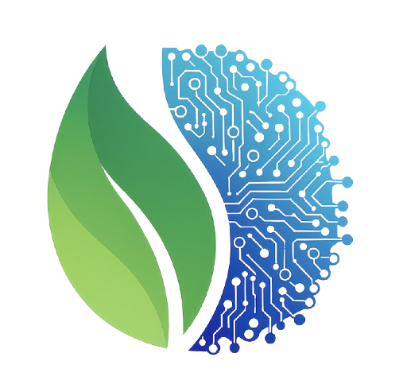

# Life Science AI - Advanced Research & Lab Management Platform

<div align="center">



**Intelligent life science platform with AI-powered research assistance, lab booking, and inquiry management**

[](https://opensource.org/licenses/MIT)
[](https://nodejs.org/)
[](https://nextjs.org/)
[](https://www.typescriptlang.org/)
[](https://vercel.com)

[Live Demo](https://life-science-ai.vercel.app) • [Report Bug](https://github.com/mimcry/life_science_ai/issues) • [Request Feature](https://github.com/mimcry/life_science_ai/issues)

</div>

## 🧬 Overview

Life Science AI is a sophisticated, enterprise-grade platform designed specifically for life science research laboratories and research institutions. It combines cutting-edge AI technology with intuitive user interfaces to streamline scientific workflows, manage laboratory resources, and accelerate research discoveries.

### 🎯 Key Features

- **🤖 Specialized AI Agents**: Seven purpose-built AI agents for different research needs
- **🎙️ Multi-Modal Input**: Seamless voice and text interaction capabilities  
- **📅 Intelligent Scheduling**: Advanced laboratory booking and calendar management
- **🔬 Research Assistance**: AI-powered guidance for methodologies and literature synthesis
- **📊 Data Analysis**: Advanced visualization and analysis for complex biological datasets
- **🔒 Enterprise Security**: SOC 2 ready with role-based access and audit trails
- **📱 Mobile Responsive**: Fully optimized for desktop, tablet, and mobile devices
- **⚡ Real-Time Performance**: 99.99% uptime with sub-3s response times

## 🚀 Quick Start

### Prerequisites

- Node.js 18.0.0 or later
- npm, yarn, or pnpm
- Git

### Installation

```bash
# Clone the repository
git clone https://github.com/mimcry/life_science_ai.git
cd life_science_ai

# Install dependencies
npm install
# or
yarn install
# or
pnpm install

# Set up environment variables
cp .env.example .env

# Run the development server
npm run dev
# or
yarn dev
# or
pnpm dev
```

Open [http://localhost:3000](http://localhost:3000) in your browser to see the application.

## 🏗️ Architecture

### Technology Stack

- **Frontend**: Next.js 15.5.12 with React 19
- **Language**: TypeScript 5.7
- **Styling**: Tailwind CSS 4.2.1 with custom design system
- **UI Components**: Radix UI primitives with custom components
- **State Management**: React hooks and context
- **API**: Next.js API routes with N8N webhook integration
- **Analytics**: Vercel Analytics
- **Deployment**: Vercel

### Project Structure

```
life_science_ai/
├── app/                    # Next.js app directory
│   ├── api/               # API routes
│   │   └── chat/        # Chat API with N8N integration
│   ├── chat/              # Chat interface page
│   ├── page.tsx          # Landing page
│   └── layout.tsx         # Root layout with SEO metadata
├── components/            # Reusable UI components
├── hooks/               # Custom React hooks
├── lib/                 # Utility functions
├── public/              # Static assets
├── styles/              # Global styles
└── README.md            # This file
```

## 🤖 AI Agents

The platform features seven specialized AI agents:

| Agent | Role | Status | Response Time |
|--------|------|--------|---------------|
| **Inquiry & Booking** | Meeting Coordinator | 🟢 Active | Instant |
| **Research Assistant** | Research Support | 🟡 Offline | 2s |
| **Data Analyst** | Data Scientist | 🟡 Offline | 3s |
| **Protocol Expert** | Lab Manager | 🟡 Offline | 2s |
| **Knowledge Base** | Information Hub | 🟡 Offline | 1s |
| **Scheduler** | Calendar Manager | 🟡 Offline | Instant |
| **Collaboration Hub** | Team Coordinator | 🟡 Offline | 1s |

## 🔧 Configuration

### Environment Variables

Create a `.env` file in the root directory:

```env
# N8N Webhook Configuration
N8N_WEBHOOK_URL=https://your-n8n-instance.com/webhook/life-science-webhook
N8N_AUDIO_WEBHOOK_URL=https://your-n8n-instance.com/webhook/life-science-webhook

# Optional: Analytics and Monitoring
NEXT_PUBLIC_ANALYTICS_ID=your-analytics-id
```

### N8N Integration

The application integrates with [N8N](https://n8n.io/) for workflow automation:

1. **Set up N8N Instance**: Deploy N8N with the life science workflow
2. **Configure Webhooks**: Set up webhook endpoints for chat and audio processing
3. **Environment Variables**: Add webhook URLs to your `.env` file
4. **Test Integration**: Use the chat interface to verify connectivity

For detailed N8N setup instructions, see [N8N_SETUP.md](./N8N_SETUP.md).

## 📱 Features Deep Dive

### Voice & Audio Capabilities

- **🎙️ Voice Recording**: High-quality audio recording with real-time waveform visualization
- **🔊 Audio Playback**: Optimized audio streaming with mobile compatibility
- **🎛️ Audio Controls**: Play/pause, progress tracking, and volume control
- **📱 Mobile Optimized**: Auto-play handling for mobile browsers
- **🔄 Smart Audio Management**: Automatic stopping when new audio plays or recording starts

### Chat Interface

- **💬 Real-time Messaging**: Instant message delivery and receipt
- **📝 Rich Text Support**: Proper formatting with line breaks and markdown
- **📅 Event Display**: Automatic display of pending matched events
- **🎨 Responsive Design**: Optimized for all screen sizes
- **⚡ Performance**: Sub-100ms message processing

### Booking System

- **📅 Smart Scheduling**: Intelligent calendar management
- **👥 Multi-user Support**: Handle multiple concurrent bookings
- **📧 Email Integration**: Automated email notifications
- **📋 Form Validation**: Comprehensive input validation
- **📱 Mobile Forms**: Touch-friendly booking interface

## 🔒 Security & Compliance

- **🛡️ SOC 2 Ready**: Enterprise-grade security controls
- **🔐 Data Encryption**: End-to-end encryption for sensitive data
- **📝 Audit Trails**: Comprehensive logging and monitoring
- **👤 Role-Based Access**: Granular permission controls
- **🔒 Secure APIs**: Protected API endpoints with validation

## 🚀 Deployment

### Vercel (Recommended)

```bash
# Install Vercel CLI
npm i -g vercel

# Deploy to Vercel
vercel --prod
```

### Docker

```bash
# Build the image
docker build -t life-science-ai .

# Run the container
docker run -p 3000:3000 life-science-ai
```

### Environment-Specific Builds

```bash
# Development
npm run dev

# Production build
npm run build

# Start production server
npm run start

# Linting
npm run lint
```

## 📊 Performance Metrics

- **⚡ Response Time**: < 3s average
- **📈 Uptime**: 99.99% SLA
- **🔄 API Latency**: 12ms average
- **💾 Memory Usage**: Optimized for large datasets
- **📱 Mobile Performance**: 95+ Lighthouse score

## 🔧 Development

### Code Style

- **TypeScript**: Strict type checking enabled
- **ESLint**: Configured for Next.js best practices
- **Prettier**: Consistent code formatting
- **Husky**: Pre-commit hooks for code quality

### Contributing

1. **Fork the Repository**
2. **Create Feature Branch**: `git checkout -b feature/amazing-feature`
3. **Commit Changes**: `git commit -m 'Add amazing feature'`
4. **Push to Branch**: `git push origin feature/amazing-feature`
5. **Open Pull Request**: Detailed description of changes

### Development Guidelines

- Follow the existing code style and patterns
- Write comprehensive tests for new features
- Update documentation for API changes
- Ensure mobile responsiveness for UI changes
- Test audio functionality across browsers

## 🐛 Troubleshooting

### Common Issues

**Audio Not Playing on Mobile**
- Ensure user interaction before auto-play
- Check browser audio permissions
- Verify audio format compatibility

**N8N Webhook Failures**
- Verify webhook URL configuration
- Check N8N instance status
- Review network connectivity

**Build Errors**
- Clear node_modules and reinstall: `rm -rf node_modules && npm install`
- Check Node.js version compatibility
- Verify environment variables

### Debug Mode

Enable debug logging:

```bash
# Development
DEBUG=life-science-ai:* npm run dev

# Production
DEBUG=life-science-ai:* npm run build
```

## 📚 API Documentation

### Chat API

**Endpoint**: `POST /api/chat`

**Request Body**:
```json
{
  "message": "Your message here",
  "sessionId": "session-123",
  "sessionState": {}
}
```

**Response**:
```json
{
  "response": "AI response text",
  "sessionId": "session-123",
  "sessionState": {},
  "success": true
}
```

### Audio API

**Endpoint**: `POST /api/chat` (multipart/form-data)

**Request Body**:
```
audio: [File]
sessionId: "session-123"
sessionState: "{}"
```

**Response**:
```json
{
  "audioUrl": "data:audio/mpeg;base64,...",
  "sessionId": "session-123", 
  "success": true
}
```

## 🔮 Roadmap

### Upcoming Features

- **🧬 Advanced Analytics**: Enhanced data visualization
- **🔬 Lab Integration**: Direct LIMS system integration
- **🤝 Collaboration Tools**: Real-time document sharing
- **📊 Reporting Dashboard**: Comprehensive analytics dashboard
- **🌐 Multi-language Support**: International language support

### Version History

- **v3.1.0** (Current): Enhanced audio controls, mobile optimization
- **v3.0.0**: Multi-agent system, N8N integration
- **v2.0.0**: Voice recording, booking system
- **v1.0.0**: Initial release with basic chat

## 📄 License

This project is licensed under the MIT License - see the [LICENSE](LICENSE) file for details.

## 🙏 Acknowledgments

- **[Next.js](https://nextjs.org/)** - The React framework
- **[Radix UI](https://radix-ui.com/)** - UI component primitives
- **[Tailwind CSS](https://tailwindcss.com/)** - CSS framework
- **[Lucide](https://lucide.dev/)** - Icon library
- **[N8N](https://n8n.io/)** - Workflow automation
- **[Vercel](https://vercel.com/)** - Hosting platform

## 📞 Support

- **📧 Email**: support@life-science-ai.com
- **💬 Discord**: [Community Server](https://discord.gg/lifescienceai)
- **📖 Documentation**: [docs.life-science-ai.com](https://docs.life-science-ai.com)
- **🐛 Bug Reports**: [GitHub Issues](https://github.com/mimcry/life_science_ai/issues)
- **💡 Feature Requests**: [GitHub Discussions](https://github.com/mimcry/life_science_ai/discussions)

---

<div align="center">

**🧬 Built with passion for advancing life science research**

[](https://github.com/mimcry/life_science_ai)

</div>
